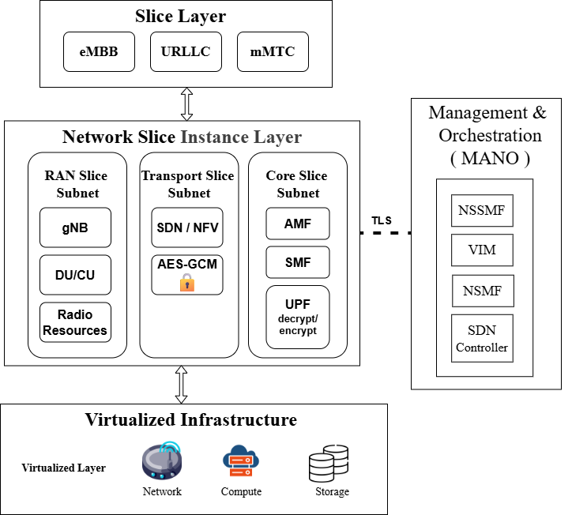
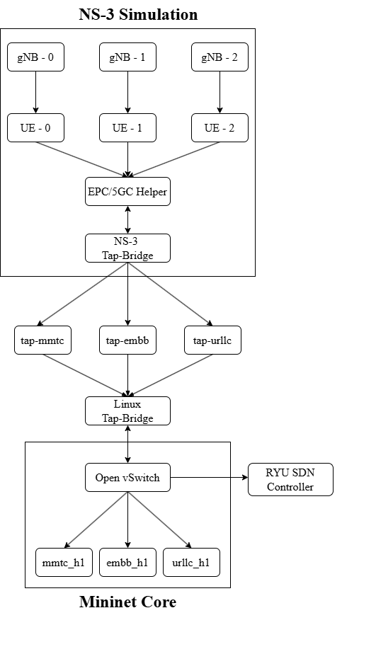
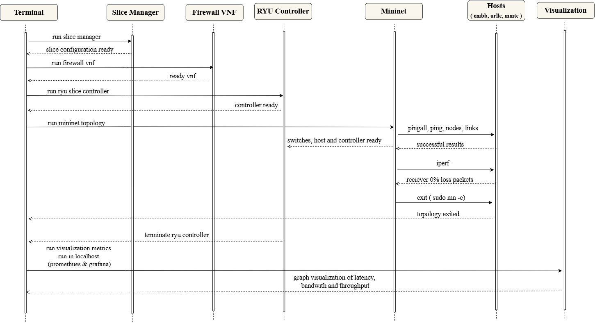
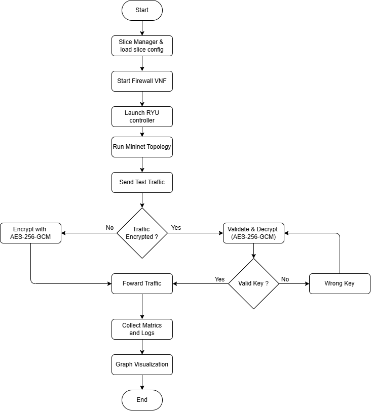

# 5G Network Slicing Orchestration Platform

[](https://www.python.org/downloads/)
[](LICENSE)
[](https://github.com)

A professional-grade 5G network slicing orchestration platform featuring dynamic resource allocation, adaptive QoS management, and intelligent traffic handling across multiple slice types (URLLC, eMBB, mMTC).

## 📋 Table of Contents

- [Overview](#overview)
- [Features](#features)
- [Architecture](#architecture)
- [Prerequisites](#prerequisites)
- [Installation](#installation)
- [Configuration](#configuration)
- [Usage](#usage)
- [Project Structure](#project-structure)
- [API Reference](#api-reference)
- [Troubleshooting](#troubleshooting)
- [Contributing](#contributing)
- [License](#license)

## 🎯 Overview

This platform provides a comprehensive solution for managing 5G network slices with support for three primary use cases:

- **URLLC** (Ultra-Reliable Low Latency): Critical real-time applications requiring <1ms latency
- **eMBB** (Enhanced Mobile Broadband): High-bandwidth streaming and multimedia services
- **mMTC** (Massive Machine Type Communications): IoT and machine-to-machine communications

The system integrates OpenFlow controllers, Mininet network simulation, and NFV components to deliver dynamic resource allocation and real-time optimization.

## ✨ Features

### Core Capabilities
- ✅ **Dynamic Resource Allocation (DRA)** - Intelligent bandwidth and resource distribution
- ✅ **Adaptive QoS Management** - Real-time quality of service adjustment
- ✅ **Multi-slice Support** - Simultaneous management of URLLC, eMBB, and mMTC slices
- ✅ **Predictive Scaling** - Machine learning-based resource forecasting
- ✅ **SLA-Aware Allocation** - Service Level Agreement compliance
- ✅ **Encryption/Decryption** - Secure slice data handling with NFV firewall
- ✅ **Real-time Monitoring** - Comprehensive metrics and analytics via Prometheus/Grafana
- ✅ **Interactive CLI** - Advanced command-line interface for slice management
- ✅ **Traffic Generation** - Intelligent synthetic traffic pattern creation
- ✅ **Topology Simulation** - Mininet-based network simulation with dynamic adjustments

### Advanced Features
- Network slicing with dynamic QoS adjustment
- Adaptive bandwidth allocation per slice
- Real-time performance monitoring and metrics collection
- Machine learning-based resource decisions
- SLA-aware resource management
- Automated traffic generation and testing
- Encrypted slice data storage and retrieval

## 🏗️ Architecture

### System Architecture Diagram


### Integration Flow Diagram


### Sequence Diagram


### Flow Chart


## 📋 Prerequisites

### System Requirements
- **OS**: Linux (Ubuntu 18.04+, Debian 10+) or macOS
- **Python**: 3.8 or higher
- **RAM**: Minimum 4GB (8GB recommended)
- **Disk Space**: At least 2GB free space
- **Network**: Root/sudo access required for network simulation

### Required Software
```bash
# Mininet network simulator
sudo apt-get install mininet

# Ryu OpenFlow controller framework
pip install ryu

# Additional system dependencies
sudo apt-get install openvswitch-switch
sudo apt-get install python3-dev
```

## 🚀 Installation

### Step 1: Clone the Repository
```bash
git clone https://github.com/yuvarajpanditrathod/5G-Network-Slicing-using-SDN-NFV-and-NS3.git
cd 5G-Network-Slicing-using-SDN-NFV-and-NS3
```

### Step 2: Install Dependencies

#### Ubuntu/Debian
```bash
# Update package manager
sudo apt-get update
sudo apt-get upgrade

# Install system dependencies
sudo apt-get install -y \
    python3 \
    python3-pip \
    python3-dev \
    mininet \
    openvswitch-switch \
    net-tools \
    iperf3 \
    curl

# Install Python dependencies
pip install --upgrade pip setuptools wheel
pip install -r requirements.txt
```

#### macOS
```bash
# Using Homebrew
brew install python3 openvswitch curl

# Install Python dependencies
pip3 install --upgrade pip setuptools wheel
pip3 install -r requirements.txt
```

### Step 3: Create Python Virtual Environment (Recommended)
```bash
python3 -m venv venv
source venv/bin/activate  # On macOS/Linux
# or
venv\Scripts\activate  # On Windows
pip install -r requirements.txt
```

### Step 4: Verify Installation
```bash
# Check Python version
python3 --version

# Check Mininet installation
mn --version

# Check Ryu installation
ryu-manager --version
```

## ⚙️ Configuration

### 1. Radio Configuration
Edit `radio_config.json` to configure radio resource parameters:
```json
{
  "gnb_total_prbs": 100,
  "default_slice_templates": {
    "URLLC": {
      "base_bandwidth": 50,
      "max_bandwidth": 200,
      "target_latency": 1,
      "reliability": 99.999
    },
    "eMBB": {
      "base_bandwidth": 100,
      "max_bandwidth": 500,
      "target_latency": 10,
      "reliability": 99.9
    },
    "mMTC": {
      "base_bandwidth": 20,
      "max_bandwidth": 100,
      "target_latency": 100,
      "reliability": 95.0
    }
  }
}
```

### 2. Monitoring Configuration
Edit `visualization/prometheus.yml` to configure Prometheus scrape targets:
```yaml
global:
  scrape_interval: 15s
  evaluation_interval: 15s

scrape_configs:
  - job_name: 'network-slicing'
    static_configs:
      - targets: ['localhost:8888']
```

### 3. Encryption Setup
Generate encryption keys (automatic on first run):
```bash
python3 slice_manager.py --generate-keys
```

## 📖 Usage

### Quick Start Guide

#### 1. Start the SDN Controller (Terminal 1)
```bash
sudo ryu-manager ryu_slicing_controller.py --verbose
```

#### 2. Create Network Topology (Terminal 2)
```bash
# Interactive mode with CLI
sudo python3 mininet_topology.py

# Or run specific traffic scenario
sudo python3 mininet_topology.py --scenario urllc
```

#### 3. Generate Input Data (Terminal 3)
```bash
# Classify and generate slices from traffic data
python3 orchestrator.py --input-dir input-data/

# Or process single file
python3 orchestrator.py --input-file input-data/urllc_traffic.csv
```

#### 4. Manage Slices (Terminal 4)
```bash
python3 slice_manager.py

# Interactive commands:
# > create-slice urllc
# > list-slices
# > monitor
# > exit
```

### Detailed Commands

#### Orchestrator Commands
```bash
# Create slices from all input files
python3 orchestrator.py --input-dir input-data/

# Process specific traffic file
python3 orchestrator.py --input-file input-data/mmtc_traffic.csv

# View slice registry
python3 orchestrator.py --show-registry

# Export slices to file
python3 orchestrator.py --export-slices output.json
```

#### Slice Manager Commands

Start the interactive manager:
```bash
python3 slice_manager.py
```

**Available Commands:**
```
help                              - Show available commands
list                              - List all active slices
monitor                           - Real-time monitoring dashboard
status                            - Show overall system status
encrypt                           - Encrypt slice data
decrypt                           - Decrypt slice data
exit                              - Exit interactive mode
```

#### Mininet Topology Commands

Interactive Mininet CLI (after topology creation):
```
embb_h1 ping -c 4 mmtc_h1         - Ping between hosts
iperf                             - Start iperf traffic test
dpctl dump-flows                  - View OpenFlow rules
dump                              - Show network topology
sh command                        - Execute shell command
exit                              - Close Mininet
```

### Example Workflows

#### Scenario 1: URLLC Slice Creation and Testing
```bash

# Terminal 1: Start NS3
python3 mininet-ns3-connectivity.py

# Terminal 2: Start SDN Controller
sudo ryu-manager ryu_slicing_controller.py --verbose

# Terminal 3: Launch Mininet topology
sudo python3 mininet_topology.py

# Terminal 4: Create URLLC slice
python3 orchestrator.py --input-file input-data/urllc_traffic.csv

# Terminal 5: Create mMTC slice
python3 orchestrator.py --input-file input-data/mmtc_traffic.csv

# Terminal 6: Create eMBBC slice
python3 orchestrator.py --input-file input-data/embb-data.mp4

# Terminal 7: Manage slice
python3 slice_manager.py
> create-slice urllc, mmtc, embb
> list
> monitor
> exit
```

#### Scenario 2: Multi-slice Optimization
```bash
# Process all traffic data
python3 orchestrator.py --input-dir input-data/

# Start management interface
python3 slice_manager.py
> list
> optimize-resources
> export-metrics metrics.json
> exit
```

#### Scenario 3: Monitoring and Analytics
```bash
# Launch visualization stack
cd visualization
python metrics_exporter.py --port 8080 --interval 2

# Access Grafana dashboard
# URL: http://localhost:3000
# Default credentials: admin/admin

# Access Prometheus dashboard
# URL: http://localhost:9090
```

## 📊 Performance Metrics

### Expected Performance Ranges

| Metric | URLLC | eMBB | mMTC |
|--------|-------|------|------|
| Latency | <1ms | 10-50ms | 100-500ms |
| Bandwidth | 20-200 Mbps | 50-500 Mbps | 10-100 Mbps |
| Reliability | 99.999% | 99.9% | 95-99% |
| Packet Size | 64B | 1400B | 100-500B |

## 🤝 Contributing

### Development Setup
```bash
git clone https://github.com/yuvarajpanditrathod/5G-Network-Slicing-using-SDN-NFV-and-NS3.git
cd 5G-Network-Slicing-using-SDN-NFV-and-NS3
python3 -m venv venv
source venv/bin/activate
```

### Code Standards
- Follow PEP 8 style guide
- Add docstrings to all functions
- Include type hints for better code clarity
- Write unit tests for new features
- Update documentation accordingly


## 📧 Contact & Support

For questions, issues, or suggestions:
- **Email**: yuvarajpanditrathod@gmail.com

## 🙏 Acknowledgments

- Mininet network simulation system
- Ryu OpenFlow controller system
- OpenFlow protocol implementation
- 5G standardization bodies (3GPP)

---
